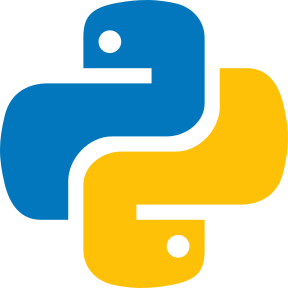

<!-- 
### Hi there 👋
**fellrock/fellrock** is a ✨ _special_ ✨ repository because its `README.md` (this file) appears on your GitHub profile.
Here are some ideas to get you started:
🔭 I’m currently working on ...
🌱 I’m currently learning ...
👯 I’m looking to collaborate on ...
🤔 I’m looking for help with ...
💬 Ask me about ...
📫 How to reach me: ...
😄 Pronouns: ...
⚡ Fun fact: ...
-->
<!-- - 📫 How to reach me: ... - ⚡ Fun fact: I love to draw and play guitar / drums
- 😄 Pronouns: ... -->
### Hi there, I'm Felipe - aka [fellrock][website] 👋

#### I'm a Dad, Husband, Dreamer, Engineer, Developer and Teacher! :v::grin:
:computer: I’m currently working on personal projects.  
:notebook: I’m currently learning more about SQL, OOP and APIs.  
:telescope: I’m looking for help to study about coding and IoT.  
:speech_balloon: Ask me about anything.  
:dart: 2023 Goals:  
&emsp;&emsp;~~1. Put my homelab to work~~  
&emsp;&emsp;2. Creating Portifolio.

### Connect with me:

[][website]
[][twitter]
[][linkedin]
[][instagram]
 

### Languages and Tools:

 
 

[website]: https://www.kravela.cloud/
[twitter]: https://twitter.com/fellrock
[instagram]: https://instagram.com/fellrock
[linkedin]: https://linkedin.com/in/fellrock

<!-- []  -->
<!-- [] -->
<!-- [] -->
<!-- [] -->
<!-- [] -->
<!-- [] -->
<!-- [] 
[]
[]
-->

